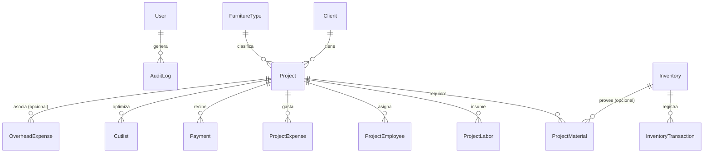

# Plan de Implementación: Sistema de Gestión de Carpintería (Next.js + Prisma)

Este documento detalla la arquitectura profesional para el **Sistema de Gestión de Carpintería**, utilizando un stack moderno, escalable y preparado para entornos multi-usuario y producción.

---

## 1. Arquitectura y Tecnologías

* **Framework Web**: Next.js 14+ (App Router) con TypeScript.
* **Base de Datos**: 
  * Desarrollo: **SQLite** (Base de datos local en archivo, ideal para desarrollo y facilidad de instalación).
  * Producción: Preparado para **PostgreSQL** (La migración requiere únicamente cambiar el proveedor en el esquema de Prisma y la variable de entorno).
* **ORM**: **Prisma ORM** para el manejo de esquemas, relaciones, migraciones y tipado de base de datos.
* **Control de Versiones**: **Git** inicializado con un archivo `.gitignore` optimizado para Next.js, Prisma y bases de datos locales.
* **Estilos**: Vanilla CSS con variables CSS avanzadas y estructurado de forma modular (CSS Modules) para un diseño premium, responsive y con soporte nativo para tema oscuro.
* **Reportes y Gráficos**: Gráficos interactivos autoconstruidos en SVG para mantener el sistema ligero y rápido, sin dependencias complejas.
* **Optimizador de Cortes**: Algoritmo 2D Bin Packing en TypeScript, integrado con la base de datos de costos de proyectos.

---

## 2. Modelo de Base de Datos (Prisma)

El esquema de base de datos en `prisma/schema.prisma` se define con las siguientes entidades:



### Detalle de Modelos Principales

* **`User`**: Usuarios del sistema (`admin` / `operator`) para el control de roles.
* **`Client`**: Registro completo de clientes, DNI/CUIT y datos de contacto.
* **`FurnitureType`**: Tipos de mueble (Cocina, Placard, Alacena, Mueble a Medida, etc.) dinámicos.
* **`Project`**: Gestión de proyectos de fabricación con estado, fechas, prioridad y balance económico.
* **`ProjectMaterial`, `ProjectLabor`, `ProjectEmployee`, `ProjectExpense`**: Desglose de costos reales.
* **`Cutlist`**: Configuración e historial de cortes para optimización por proyecto.
* **`Payment`**: Historial de cobros parciales por proyecto.
* **`OverheadExpense`**: Gastos fijos/generales del taller (Alquiler, Luz, Agua, etc.).
* **`Inventory` & `InventoryTransaction`**: Control de stock e historial de movimientos.
* **`AuditLog`**: Registro detallado de inserciones, ediciones y eliminaciones físicas/lógicas.

---

## 3. Estructura de Directorios

El proyecto se creará en `C:\Users\nacho\.gemini\antigravity\scratch\carpinteria-gestion`:

```text
carpinteria-gestion/
├── prisma/
│   ├── schema.prisma       # Definición de base de datos
│   └── seed.ts             # Datos de ejemplo iniciales (Clientes, Proyectos, Stock)
├── src/
│   ├── app/                # Next.js App Router
│   │   ├── page.tsx        # Dashboard principal
│   │   ├── layout.tsx      # Contenedor principal con barra de navegación lateral
│   │   ├── clientes/       # CRUD de Clientes
│   │   ├── proyectos/      # CRUD de Proyectos, Costos, Pagos y Corte
│   │   ├── gastos/         # CRUD de Gastos Generales
│   │   ├── inventario/     # CRUD de Inventario y Stock
│   │   └── api/            # API REST endpoints
│   ├── components/         # Componentes compartidos y visuales (Gráficos, Optimizador, Modales)
│   ├── lib/                # Utilidades de base de datos, algoritmos de corte y prisma.ts
│   └── styles/             # CSS Global y variables de diseño premium
├── .env                    # Variables de entorno (DATABASE_URL)
├── .gitignore              # Configuración de Git
├── README.md               # Instrucciones de instalación y migración
└── package.json            # Dependencias
```

---

## 4. Plan de Instalación del Entorno (Paso a Paso)

Dado que Node.js y Git no están en el PATH actual, realizaremos lo siguiente:

1. **Instalar Node.js LTS**: Usaremos `winget install OpenJS.NodeJS.LTS`.
2. **Instalar Git**: Usaremos `winget install Git.Git`.
3. **Refrescar Entorno**: Usaremos la ruta absoluta de Node y Git en la consola de comandos de este agente para evitar reiniciar el sistema o la consola.
   * Node: `C:\Program Files\nodejs\node.exe`
   * NPM: `C:\Program Files\nodejs\npm.cmd`
   * NPX: `C:\Program Files\nodejs\npx.cmd`
   * Git: `C:\Program Files\Git\cmd\git.exe`
4. **Inicializar Proyecto Next.js**: Crearemos la aplicación Next.js y configuraremos Prisma.
5. **Configurar SQLite**: Inicializar Prisma con el proveedor SQLite, generar la migración y correr el seed.

---

## 5. Diseño de Pantallas y Componentes

* **Dashboard**: Indicadores de proyectos por estado, total facturado y pendiente de cobro en el mes. Un gráfico SVG interactivo de barras (ingresos vs gastos) y alertas de pagos/entregas próximas.
* **Vista Proyecto / Costos**: Pestañas modulares que permiten navegar entre:
  * *Datos Generales*: Estado, fechas y prioridad.
  * *Costos*: Tablas dinámicas para agregar materiales, mano de obra e insumos.
  * *Pagos*: Control de señas y cuotas recibidas.
  * *Optimizador de Cortes*: Tablas para ingresar placas y piezas, ejecutar el algoritmo de distribución de cortes y visualizar el diagrama.
* **Optimizador de Cortes (CutList Optimizer)**:
  * Tabla dinámica para agregar piezas a cortar (longitud, ancho, cantidad, dirección de veta, etc.).
  * Tabla dinámica de placas de melamina disponibles (2750x1830, etc.) con sus costos.
  * Algoritmo de empaquetamiento 2D bidimensional implementado en JavaScript/TypeScript que respete `kerf` (grosor del corte de sierra) y refilados.
  * Renderizado del plano de corte utilizando SVG dinámicos interactivos escalados, coloreando piezas, sobrantes y desperdicio, mostrando etiquetas y medidas.
  * Botón para transferir automáticamente el costo de las placas utilizadas al total de materiales del proyecto.

---

## 6. Plan de Verificación y Pruebas

### Pruebas Automatizadas (Prisma + Seed)
* Ejecución del comando de seed para asegurar que la base de datos SQLite se crea correctamente, aplica las claves foráneas y relaciones, y permite realizar consultas de prueba.
* Scripts de prueba en la base de datos local para verificar cascadas en relaciones (ej. borrar un proyecto debe limpiar sus tablas dependientes sin romper la base de datos).

### Pruebas de Algoritmo de Corte
* Caso de prueba con dimensiones reales de placas de melamina (`2750 x 1830 mm`) y una lista de 15 piezas de un mueble de cocina para garantizar que el algoritmo organice las piezas de forma eficiente, respete el grano de madera y calcule correctamente los porcentajes de desperdicio e integración de costos.

---

## 7. Preguntas Abiertas e Hitos

> [!IMPORTANT]
> **Preguntas para el usuario:**
> 1. Para la autenticación inicial, ¿prefiere un inicio de sesión simple con usuario y rol guardado en cookies/sesión local para facilitar el uso diario en el taller?
> 2. ¿Desea que instalemos alguna librería gráfica de React (como Lucide-React para íconos) o prefiere íconos SVG puros para mantener el proyecto libre de dependencias externas? (Recomendamos Lucide-React por facilidad y estética).

---
### Próximo Paso
Una vez aprobado este plan de arquitectura profesional:
1. Procederemos a instalar Node.js y Git utilizando `winget` y los comandos de sistema.
2. Inicializaremos el repositorio Git y crearemos la estructura base del proyecto.
3. Configuraremos Prisma ORM con el modelo de base de datos relacional SQLite y generaremos la migración inicial.
